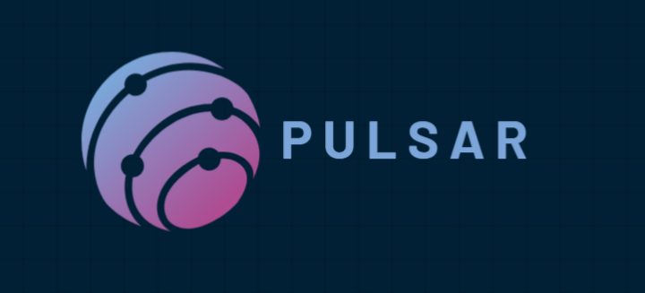

# Pulsar E-commerce Web App



Welcome to **Pulsar E-commerce**, an online platform designed to provide a seamless shopping experience. This web app includes both a frontend and a backend.

## How to Run the Project

### 1. Backend Setup

- Navigate to the **/backend** directory.
- Run the following command to start the backend server:

```bash
  npm run dev
```

### 2.Frontend Setup

- Open A new terminal
- Navigate to the **/frontend** directory.
- Run the following command to start frontend server:

```bash
    npm run dev
```

### 3.Access the Web App

- after run both servers
- http://localhost:5000

## Technologies Used:

### FrontEnd

    - React, Axios

### BackEnd

    - Node.js, Express

### Database

    - MongoDB (Mongoose)
